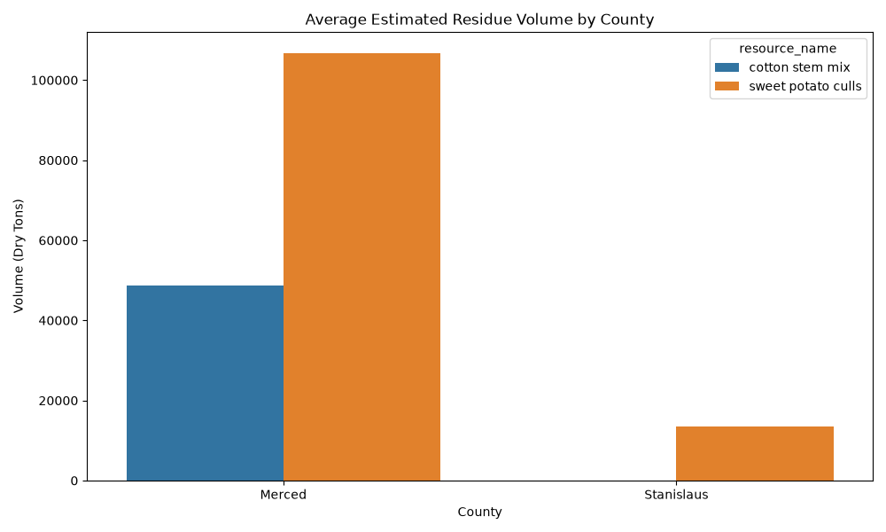
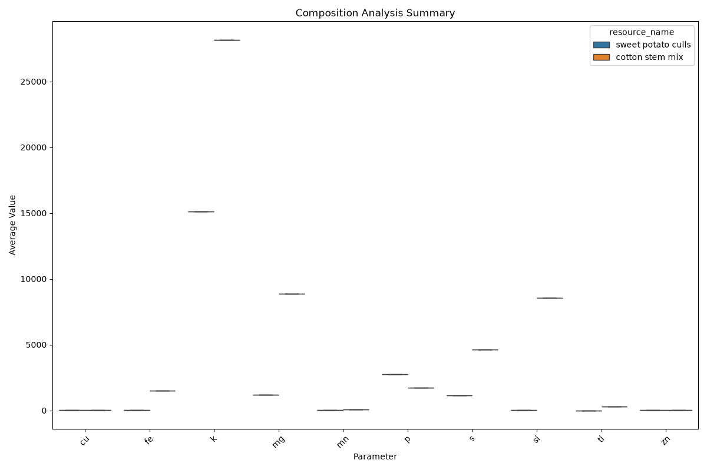

# Cotton and Sweet Potato Biomass Report

This report summarizes the availability, composition, and conversion potential
of cotton and sweet potato residues in San Joaquin, Stanislaus, and Merced
counties.

## 1. Biomass Availability

The following table and chart show the estimated volume of these resources
across the target counties.

### Volume Data Summary

| Resource           | County     | Year | Estimated Volume (Dry Tons) |
| :----------------- | :--------- | ---: | --------------------------: |
| cotton stem mix    | Merced     | 2017 |                     57319.2 |
| cotton stem mix    | Merced     | 2022 |                     39981.6 |
| sweet potato culls | Merced     | 2023 |                      120993 |
| sweet potato culls | Merced     | 2024 |                     92405.6 |
| sweet potato culls | Stanislaus | 2023 |                     14023.6 |
| sweet potato culls | Stanislaus | 2024 |                     12900.2 |

## 2. Composition Analysis

Composition data provides insights into the chemical makeup of the biomass,
which is critical for determining suitable conversion pathways.

### Composition Data Summary (Averages)

| Resource           | Parameter       | Unit           | Average Value |
| :----------------- | :-------------- | :------------- | ------------: |
| cotton stem mix    | al              | ppm            |       2950.83 |
| cotton stem mix    | ash solids      | % total weight |       9.15917 |
| cotton stem mix    | ba              | ppm            |          27.5 |
| cotton stem mix    | ca              | ppm            |       19483.3 |
| cotton stem mix    | ce              | ppm            |          47.4 |
| cotton stem mix    | cu              | ppm            |       15.1667 |
| cotton stem mix    | fe              | ppm            |       1486.25 |
| cotton stem mix    | k               | ppm            |         28175 |
| cotton stem mix    | la              | ppm            |            36 |
| cotton stem mix    | mg              | ppm            |       8881.82 |
| cotton stem mix    | mn              | ppm            |         66.75 |
| cotton stem mix    | mo              | ppm            |           6.5 |
| cotton stem mix    | moisture        | % total weight |       9.61417 |
| cotton stem mix    | p               | ppm            |        1727.5 |
| cotton stem mix    | pb              | ppm            |       5.66667 |
| cotton stem mix    | pr              | ppm            |         58.75 |
| cotton stem mix    | rb              | ppm            |          19.5 |
| cotton stem mix    | s               | ppm            |        4607.5 |
| cotton stem mix    | si              | ppm            |          8540 |
| cotton stem mix    | sr              | ppm            |         84.25 |
| cotton stem mix    | th              | ppm            |       61.9167 |
| cotton stem mix    | ti              | ppm            |       289.333 |
| cotton stem mix    | total solids    | % total weight |       90.3858 |
| cotton stem mix    | u               | ppm            |         20.75 |
| cotton stem mix    | volatile solids | % total weight |        81.225 |
| cotton stem mix    | y               | ppm            |       8.33333 |
| cotton stem mix    | zn              | ppm            |       24.3333 |
| sweet potato culls | al              | ppm            |          12.5 |
| sweet potato culls | b               | ppm            |           9.1 |
| sweet potato culls | ca              | ppm            |          2610 |
| sweet potato culls | cu              | ppm            |       9.53333 |
| sweet potato culls | fe              | ppm            |          37.5 |
| sweet potato culls | glucan          | % dry weight   |       54.1767 |
| sweet potato culls | glucose         | % dry weight   |          60.2 |
| sweet potato culls | glucose_yld     | % of glucan    |        37.875 |
| sweet potato culls | k               | ppm            |         15100 |
| sweet potato culls | lignin          | % dry weight   |       8.70667 |
| sweet potato culls | mg              | ppm            |          1175 |
| sweet potato culls | mn              | ppm            |       12.3333 |
| sweet potato culls | na              | ppm            |          1195 |
| sweet potato culls | nd              | ppm            |          10.7 |
| sweet potato culls | nitrogen        | pc             |          1.57 |
| sweet potato culls | p               | ppm            |          2735 |
| sweet potato culls | s               | ppm            |       1126.67 |
| sweet potato culls | si              | ppm            |            25 |
| sweet potato culls | ti              | ppm            |             0 |
| sweet potato culls | xylan           | % dry weight   |       3.17667 |
| sweet potato culls | xylose          | % dry weight   |          3.61 |
| sweet potato culls | xylose_yld      | % of xylan     |         64.96 |
| sweet potato culls | zn              | ppm            |          14.8 |

## 3. Fermentation Potential

Data on fermentation yields and parameters. | Resource | Product | Unit |
Average Value | |:-------------------|:------------|:-------|----------------:|
| sweet potato culls | 3hptiter | g_l | 3.81667 | | sweet potato culls |
3hpyield | g_g | 0.0666667 | | sweet potato culls | gluconct0 | g_l | 95.0233 |
| sweet potato culls | gluconcteof | g_l | 53.2033 | | sweet potato culls |
sugar_cons | pc | 58.25 | | sweet potato culls | sugart0 | g_l | 144.863 | |
sweet potato culls | sugarteof | g_l | 86.61 | | sweet potato culls | xylconct0
| g_l | 49.84 | | sweet potato culls | xylconcteof | g_l | 33.41 |

## 4. Gasification Potential

Data on gasification outputs and parameters. _No gasification data found for
these resources._
