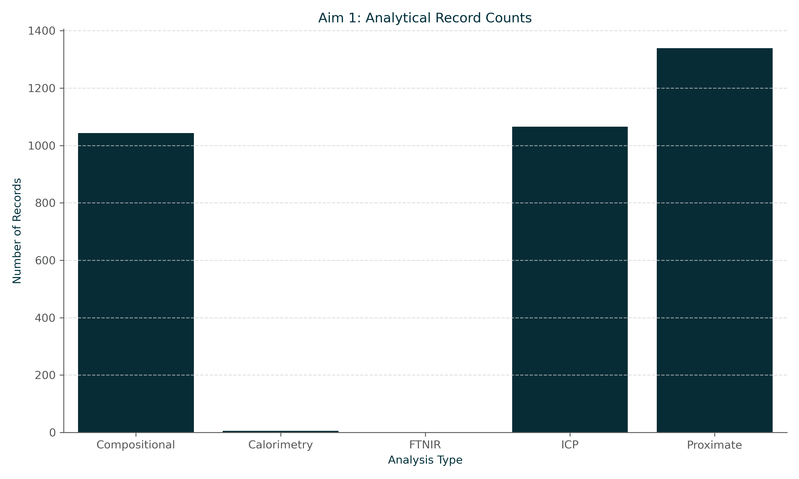
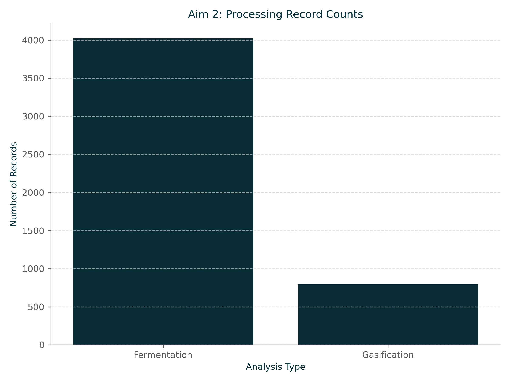
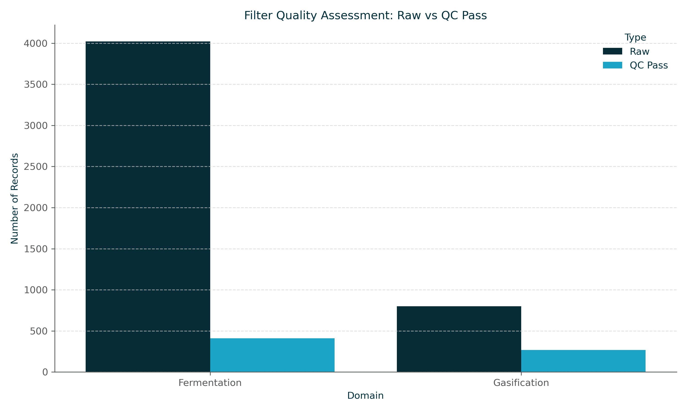

# Visualization Gallery

## Aim 1: Analytical Record Counts

*Distribution of analytical records in the database across different analysis types (Compositional, ICP, Proximate, etc.).*
> **Source:** [`analysis/data_summary_viz.py`](analysis/data_summary_viz.py) | **Generated:** 2026-06-26 20:10 UTC

## Aim 2: Processing Record Counts

*Counts of processing records for Fermentation and Gasification experiments.*
> **Source:** [`analysis/data_summary_viz.py`](analysis/data_summary_viz.py) | **Generated:** 2026-06-26 20:10 UTC

## Filter Quality Assessment

*Comparison between raw data entries and those that successfully passed Quality Control (QC) filters for the data portal views.*
> **Source:** [`analysis/data_summary_viz.py`](analysis/data_summary_viz.py) | **Generated:** 2026-06-26 20:10 UTC

## Biomass Composition: Xylan vs Glucan
[Interactive Visualization](plots/biomass_xylan_glucan.html)
*A scatter plot showing the relationship between Xylan and Glucan content across various biomass resources. Almond-based resources are highlighted in gold.*
> **Source:** [`analysis/biomass_xylan_glucan_viz.py`](analysis/biomass_xylan_glucan_viz.py) | **Generated:** 2026-06-26 20:10 UTC

## Aim 1: XRF Data Distribution
[Interactive Visualization](plots/xrf_distribution_viz.html)
*Violin plot showing the distribution and variance of elemental concentrations from XRF analysis across various biomass resources.*
> **Source:** [`analysis/xrf_distribution_viz.py`](analysis/xrf_distribution_viz.py) | **Generated:** 2026-06-26 20:30 UTC
